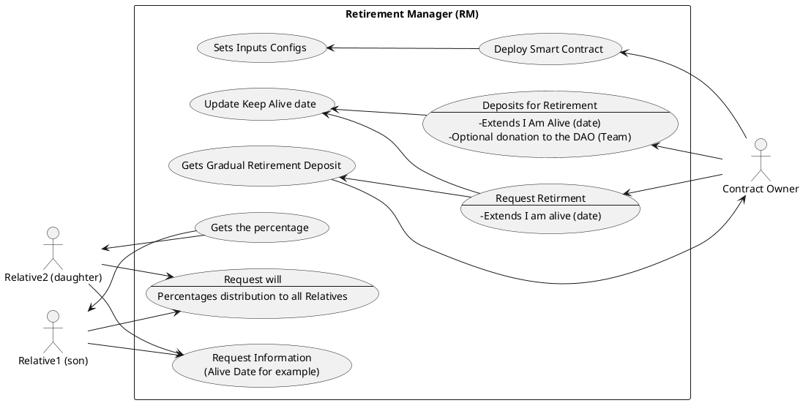
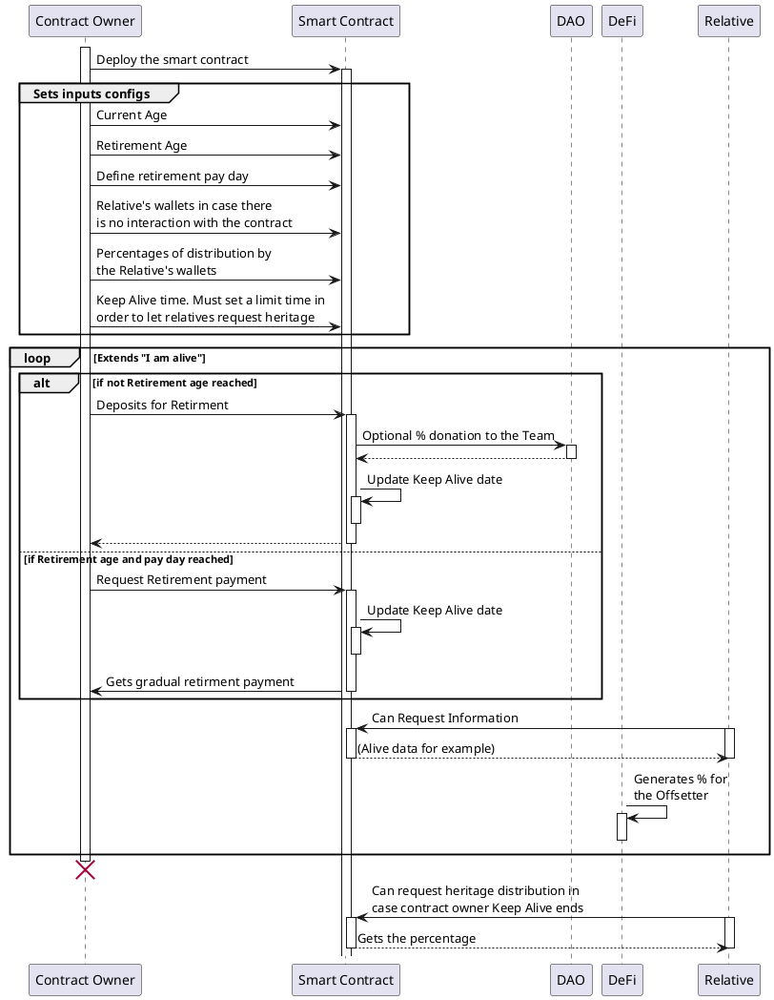

# Retirement Manager Smart Contract (RetMan)

:::info
#### Table of Contents
[TOC]
:::

## Simple Summary

A Retirement Smart Contract for private assets management and DeFi integrations.

## Abstract

A Smart Contract which accomplish the basic function of a retirement institution and a will, by holding the tokens of a person, some enhacements against the centralized models can be privacy, transparency and easy integration to DeFi protocols for pasive income and/or to DAO governance / governance and pasive income respectively.
> Don't trust institutions, trust mathematics.


## Motivation

Currently, there are lots of issues with the world's retirement systems, specially in Third World countries, where corruption on the banking and governments can lead to abusive fees, negative interests, and other issues which can lead our elders into bankruptcy. 


Our proposal is to provide a tool that enhances the privacy on their assets, independently from any centralized system, facilitating future integrations with DeFI.

## Implementation

> Version 1: intends to be a free smart contract that anyone can deploy
> Documentation and DAPP development donations included (with a onepager)

> Version 2: Go DeFI & DAO

>Actor to get a ROI over the basics one of the version 1

 
## Use Case:



Img 1. REST Usecase Diagram.

1. User Deploys the smart contract (AS contract owner)
2. User (contract owner) inputs into the smart contract:
    - Current Age
    - Retirement Age
    - Amount of months, years that the retirement will be distributed
    - Relative's wallets in case there is no interaction with the contract
    - Keep Alive time. Must set a limit time in order to let relatives request heritage
    - Percentages of distribution by the Relative's wallets

3. Relatives
    - Can request heritage distribution in case contract owner Keep Alive ends
    - Must sign confirmation with the smart contract as a relative ?
    - Can visualize smart contract data only on the request for his related address

4. Smart Contract
    - Shows basic interface public data
    - Can have some ERC20 features basics
    - Measures the ammount and time of the last transaction/deposit
    - If the Keep Alive time is reached, Relatives may request the heritage
    - Can change ownership (?)
    - Contract Owner can Update parameters at anytime on request.
    - Contract Owner can request the money (Emergency Mode)

5. Extras
    - Donation percentage to RET Team per transaction or optional disable (fixable)
    - Interface with metrics on request
    - keep it simple and stupid.


Img 2. REST Sequence Diagram.

ToDo: Describe Img2 diagram.

### Tokenomics


## Implementation

Not yet implemented.


## References

[1] P1R0; Bleecker,“DCF DAO Phase0”, https://hackmd.io/A9LNZFTlQsC32gqDw1C7EQ, 01-2023.

## Copyright
```
Copyright (C)  Hernández García Alvaro, Huerta Valdez Omar Octavio, Perez Negrón Rocha David Eugenio, Mr. Bigotes.  
Permission is granted to copy, distribute and/or modify this document
under the terms of the GNU Free Documentation License, Version 1.3
or any later version published by the Free Software Foundation;
with no Invariant Sections, no Front-Cover Texts, and no Back-Cover Texts.
A copy of the license is included in the section entitled "GNU
Free Documentation License". 
```